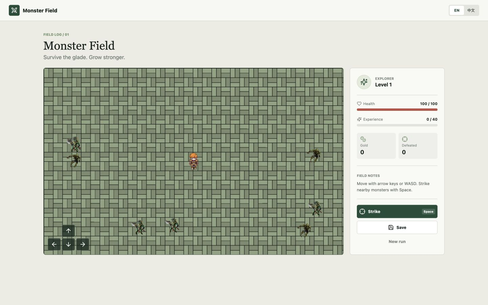

# 怪物原野

<!-- repo-languages:start -->
[English](README.md) | 简体中文
<!-- repo-languages:end -->

<!-- repo-badges:start -->

<!-- repo-badges:end -->

一款使用 React 与 Phaser 构建的轻量生存游戏。在像素原野中探索、对抗游荡的怪物、获得经验并升级，还可以将进度保存在本地。

[开始游戏](https://shenzhepei.github.io/game-monster/)

## 功能

- 使用 Phaser 实现移动、动画、碰撞与怪物追踪
- 支持键盘和触控移动，以及近距离攻击
- 完整的生命、经验、等级、金币与击败数量成长
- 本地手动存档，并可随时开始新的冒险
- 保留早期项目中的原创像素角色与怪物素材
- 完整适配桌面和移动端的中英文界面

## 本地开发

需要 Node.js 24 和 pnpm 10.33.2。

    corepack enable
    pnpm install
    pnpm dev

运行生产构建与测试：

    pnpm build
    pnpm test:coverage

## 许可证

MIT。原项目 2020 年的版权声明保留在 [LICENSE](LICENSE) 中。
